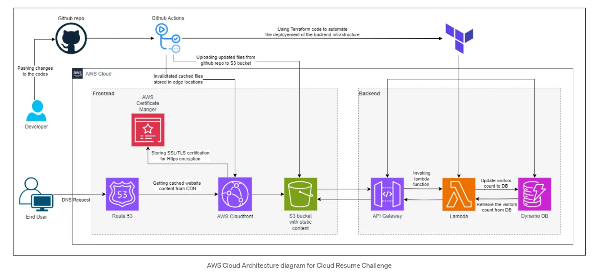

# AWS Cloud Resume Challenge

This my own aws cloud resume challenge attempt. In case you are unfamiliar with this challenge,
here is a link to the website: [aws-cloud-resume-challenge](https://cloudresumechallenge.dev/docs/the-challenge/aws/).  
The website I created is available here: [https://2.cloudresumechallengebyfelix.click/](https://2.cloudresumechallengebyfelix.click/).

In short, this challenge incorporates many different aws services, devOps practices, terraform, as well as some html, css and js.

#### This project uses:
1. S3
2. Cloudfront
3. Route 53
4. ACM (Amazon Certificate Manager)
5. DynamoDB
6. Lambda
7. API Gateway

#### As well as:
1. HTML/CSS/Javascript
2. terraform
3. python
4. git
5. Github actions

